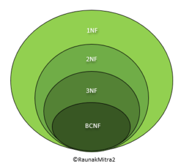
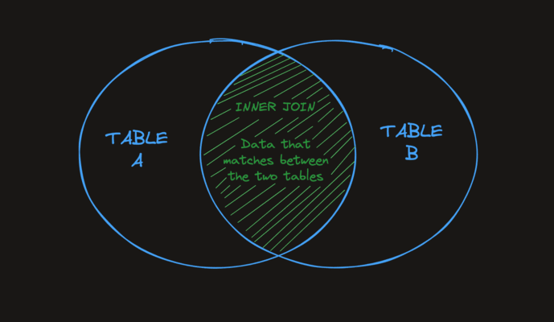
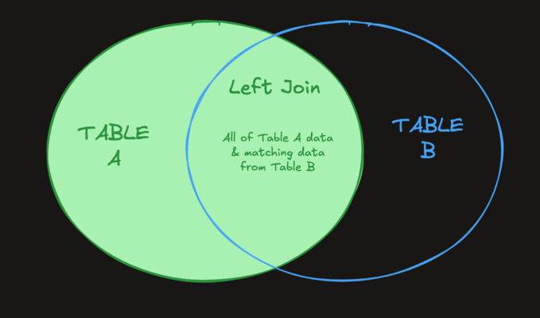
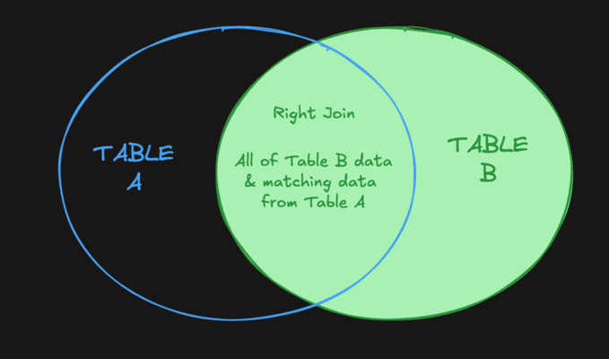
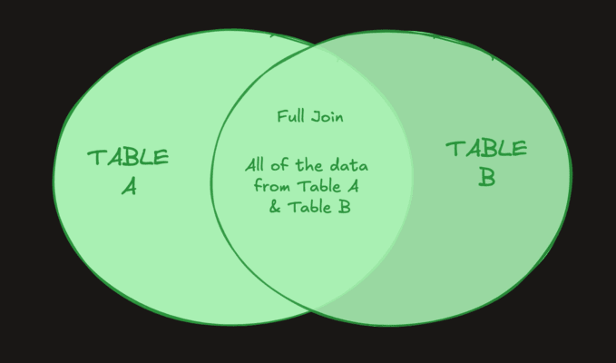

#+TITLE: SQL and PostgreSQL

In computing, a database is an organized collection of data. SQL is the software
that interacts with the database engine to capture and analyze data. Different
Database engines use different types of SQL, but most are similar enough to be
understandable if you know at least one.

In this repository I am going to skip over a lot of the basics of working with a
Database as I have already learned and relearned it a couple of times in my
life. There are plenty of guides online that can you teach you the basics quite
efficiently. I will however put snippets of sql files and general notes about
some of the topics I learn.

* Notes
** Keywords
   Postgres has the following keywords:
   - ~FROM~: Dictates which table to run query on.
   - ~SELECT~: Used to select rows from a table.
   - ~AS~: Used to dictate custom name for column in results.

** Column Data Types
   Postgres supports the following column data types:
   - ~VARCHAR(50)~: Variable length character. In this case our column would
     only accept strings less than or equal to 50 characters in length, but that
     number can be changed to any length we need.
   - ~INTEGER~: A number without a decimal within: =-2,147,483,647= to
     =2,147,483,647=. Anything larger or small will result in an error

** Math Operators
   Postgres supports the following math operators:
   - ~+~: Add
   - ~-~: Subtract
   - ~*~: Multiply
   - ~/~: Divide
   - ~^~: Exponent
   - ~|/~: Square Root
   - ~@~: Absolute Value
   - ~%~: Remainder

** String Operators and Functions
   Postgres supports the following string operator and functions:
   - ~||~: Join two strings
   - ~CONCAT()~: Join two strings
   - ~LOWER()~: Gives a lower case string
   - ~LENGTH()~: Gives number of characters in a string
   - ~UPPER()~: Gives an upper case string

** Aggregations
   An "aggregation" is a single value that's derived by combining several other
   values. Here are some valuable aggregations to know:
   - ~COUNT()~: returns the number of records.
   - ~SUM()~: returns the sum of all values for a column.
   - ~MAX()~: returns the max value for a column.
   - ~MIN()~: returns the minimum value for a column.
   - ~AVG()~: returns the average of the values for a column.
   - ~ROUND(value, precision)~: allows you to specify both the value you wish to
     round and the precision to which you wish to round it. If no precision is
     given, SQL will round the value to the nearest whole value.

*** GROUP BY
    SQL offers the ~GROUP BY~ clause which can group rows that have similar
    values into "summary" rows. It returns one row for each group. The
    interesting part is that each group can have an aggregate function applied
    to it that operates only on the grouped data.

    Imagine you have the following database:
    | song_id | title     | album_id |
    |---------+-----------+----------|
    |       1 | Crawl     |       10 |
    |       2 | Oakland   |       10 |
    |       3 | Bonfire   |       11 |
    |       4 | Fire Fly  |       11 |
    |       5 | Heartbeat |       11 |
    |       6 | Sober     |       12 |

    Here is an example query:
    #+begin_src sql
      SELECT album_id, count(song_id) AS song_count
      FROM songs
      GROUP BY album_id;
    #+end_src

    This query retrieves a count of all the songs on each album. One record is
    returned per album, and they each have their own count:
    | album_id | song_count |
    |----------+------------|
    |       10 |          2 |
    |       11 |          3 |
    |       12 |          1 |

*** HAVING
    When we need to filter the results of a ~GROUP BY~ query even further, we
    can use the ~HAVING~ clause. The ~HAVING~ clause specifies a search
    condition for a group.

    The ~HAVING~ clause is similar to the ~WHERE~ clause, but it operates on
    groups after they've been grouped, rather than rows before they've been
    grouped.

    #+begin_src sql
      SELECT album_id, count(id) as count
      FROM songs
      GROUP BY album_id
      HAVING count > 5;
    #+end_src

    This query returns the ~album_id~ and count of its songs, but only for
    albums with more than 5 songs.

**** HAVING vs WHERE
     It's fairly common for developers to get confused about the difference
     between the ~HAVING~ and the ~WHERE~ clauses - they're pretty similar after
     all.

     The difference is fairly simple in actuality:
     - A ~WHERE~ condition is applied to all the data in a query before it's
       grouped by a ~GROUP BY~ clause.
     - A ~HAVING~ condition is only applied to the grouped rows that are
       returned after a ~GROUP BY~ is applied.

     This means that if you want to filter based on the result of an
     aggregation, you need to use ~HAVING~. If you want to filter on a value
     that's present in the raw data, you should use a simple ~WHERE~ clause.

** Subqueries
   Sometimes a single query is not enough to retrieve the specific records we
   need.

   It is possible to run a query on the result set of another query - a query
   within a query! This is called a "subquery".

   Subqueries can be very useful in a number of situations when trying to
   retrieve specific data that wouldn't be accessible by simply querying a
   single table.

*** Retrieving Data from Multiple Tables
    Here is an example of a subquery:
    #+begin_src sql
      SELECT id, song_name, artist_id
      FROM songs
      WHERE artist_id IN (
          SELECT id
          FROM artists
          WHERE artist_name LIKE 'Rick%'
      );
    #+end_src

    In this hypothetical database, the query above selects all of the ~ids~,
    ~song_names~, and ~artist_ids~ from the ~songs~ table that are written by
    artists whose name starts with "Rick". Notice that the subquery allows us to
    use information from a different table - in this case the ~artists~ table.

*** Subquery Syntax
    The only syntax unique to a subquery is the parentheses surrounding the
    nested query. The ~IN~ operator could be different, for example, we could
    use the = operator if we expect a single value to be returned.

** NoSQL vs. SQL
   When talking about SQL databases, we also have to mention the elephant in the
   room: ~NoSQL~.

   To put it simply, a NoSQL database is a database that does not use SQL
   (Structured Query Language). Each NoSQL typically has its own way of writing
   and executing queries. For example, MongoDB uses MQL (MongoDB Query Language)
   and ElasticSearch simply has a JSON API.

   While most relational databases are fairly similar, NoSQL databases tend to
   be fairly unique and are used for more niche purposes. Some of the main
   differences between a SQL and NoSQL databases are:

   NoSQL databases are usually non-relational, SQL databases are usually
   relational (we'll talk more about what this means later). SQL databases
   usually have a defined schema, NoSQL databases usually have dynamic
   schema. SQL databases are table-based, NoSQL databases have a variety of
   different storage methods, such as document, key-value, graph, wide-column,
   and more.

* Table Relationships
  There are 3 primary types of relationships in a relational database:
  - One-to-one
  - One-to-many
  - Many-to-many

** One-to-one
   A one-to-one relationship most often manifests as a field or set of fields on
   a row in a table. For example, a ~user~ will have exactly one ~password~.

   Settings fields might be another example of a one-to-one relationship. A user
   will have exactly one ~email_preference~ and exactly one ~birthday~.

   Here is an example:
   - A ~customers~ table and an ~orders~ table. Each customer has =0=, =1=, or
     many orders that they've placed.
   - A ~users~ table and a ~transactions~ table. Each ~user~ has =0=, =1=, or
     many transactions that they've taken part in.
   #+begin_src sql
     CREATE TABLE customers (
         id INTEGER PRIMARY KEY,
         name TEXT NOT NULL
     );

     CREATE TABLE orders (
         id INTEGER PRIMARY KEY,
         amount INTEGER NOT NULL,
         customer_id INTEGER,
         CONSTRAINT fk_customers
         FOREIGN KEY (customer_id)
         REFERENCES customers(id)
     );
   #+end_src

** Many-to-many
   A many-to-many relationship occurs when multiple records in one table can be
   related to multiple records in another table.

   Here is an example:
   - A ~products~ table and a ~suppliers~ table - Products may have =0= to many
     suppliers, and suppliers can supply =0= to many products.
   - A ~classes~ table and a ~students~ table - Students can take potentially
     many classes and classes can have many students enrolled.

*** Joining Table
    Joining tables help define many-to-many relationships between data in a
    database. As an example when defining the relationship above between
    products and suppliers, we would define a joining table called
    ~products_suppliers~ that contains the primary keys from the tables to be
    joined.

    Then, when we want to see if a supplier supplies a specific product, we can
    look in the joining table to see if the ids share a row.

*** Unique Constraint Across 2 Fields
    When enforcing specific schema constraints we may need to enforce the
    ~UNIQUE~ constraint across two different fields:
    #+begin_src sql
      CREATE TABLE product_suppliers (
        product_id INTEGER,
        supplier_id INTEGER,
        UNIQUE(product_id, supplier_id),
        FOREIGN KEY (product_id) REFERENCES products (id),
        FOREIGN KEY (supplier_id) REFERENCES suppliers (id)
      );
    #+end_src

    This lets multiple rows share the same ~product_id~ or ~supplier_id~, but it
    prevents any two rows from having both the same ~product_id~ and
    ~supplier_id~.
    
** Database Normalization
   Database normalization is a method for structuring your database schema in a
   way that helps:
   - Improve data integrity
   - Reduce data redundancy

*** What Is Data Integrity?
    "Data integrity" refers to the accuracy and consistency of data. For
    example, if a user's age is stored in a database, rather than their
    birthday, that data becomes incorrect automatically with the passage of
    time.

    It would be better to store a birthday and calculate the age as needed.

*** What Is Data Redundancy?
    "Data redundancy" occurs when the same piece of data is stored in multiple
    places. For example: saving the same file multiple times to different hard
    drives.

    Data redundancy can be problematic, especially when data in one place is
    changed such that the data is no longer consistent across all copies of that
    data.

** Normal Forms
   The creator of "database normalization", [[https://en.wikipedia.org/wiki/Edgar_F._Codd][Edgar F. Codd]] described different
   "normal forms" a database can adhere to. We'll talk about the most common
   ones:
   - First normal form (1NF)
   - Second normal form (2NF)
   - Third normal form (3NF)
   - Boyce-Codd normal form (BCNF)

   

   In short, 1st normal form is the least "normalized" form, and Boyce-Codd is
   the most "normalized" form.

   The more normalized a database, the better its data integrity, and the less
   duplicate data you'll have.

*** In the Context of Normal Forms, “Primary Key” Means Something a Bit Different
    In the context of database normalization, we're going to use the term
    "primary key" slightly differently. When we're talking about SQLite, a
    "primary key" is a single column that uniquely identifies a row.

    When we're talking more generally about data normalization, the term
    "primary key" means the collection of columns that uniquely identify a
    row. That can be a single column, but it can actually be any number of
    columns that form a [[https://en.wikipedia.org/wiki/Composite_key][composite key]]. A primary key is the minimum number of
    columns needed to uniquely identify a row in a table.

    If you think back to the many-to-many joining table ~product_suppliers~,
    that table's "primary key" was actually a combination of the 2 ids,
    ~product_id~ and ~supplier_id~:
    #+begin_src sql
      CREATE TABLE product_suppliers (
          product_id INTEGER,
          supplier_id INTEGER,
          UNIQUE(product_id, supplier_id)
      );
    #+end_src

** Normal Form (1NF)
   To be compliant with first normal form, a database table simply needs to
   follow 2 rules:
   - It must have a unique primary key.
   - A cell can't have a nested table as its value (depending on the database
     you're using, this may not even be possible).

   Example of *NOT* 1st Normal Form:
   | name  | age | email          |
   |-------+-----+----------------|
   | Lane  |  27 | lane@boot.dev  |
   | Lane  |  27 | lane@boot.dev  |
   | Allan |  27 | allan@boot.dev |

   This table does not adhere to 1NF. It has two identical rows, so there isn't
   a unique primary key for each row.

   The simplest way (but not the only way) to get into first normal form is to
   add a unique id column. Example of 1st Normal Form:
   | id | name  | age | email          |
   |----+-------+-----+----------------|
   |  1 | Lane  |  27 | lane@boot.dev  |
   |  2 | Lane  |  27 | lane@boot.dev  |
   |  3 | Allan |  27 | allan@boot.dev |

   It's worth noting that if you create a "primary key" by ensuring that two
   columns are always "unique together" that works too.

*** You Should Almost Never Design a Table That Doesn't Adhere to 1NF
    First normal form is simply a good idea. I've never built a database schema
    where each table isn't at least in first normal form.

** 2nd Normal Form (2NF)
   A table in [[https://en.wikipedia.org/wiki/Second_normal_form][second normal form]] follows all the rules of 1st normal form, and
   one additional rule which only applies to composite primary keys:
   - All columns that are not part of the primary key are dependent on the
     entire primary key, and not just one of the columns in the primary key.

*** Example of 1st NF, but Not 2nd NF
    In this table, the primary key is a combination of ~first_name~ +
    ~last_name~:
    | first_name | last_name | first_initial |
    |------------+-----------+---------------|
    | Lane       | Wagner    | l             |
    | Lane       | Small     | l             |
    | Allan      | Wagner    | a             |

    This table does not adhere to 2NF. The ~first_initial~ column is entirely
    dependent on the ~first_name~ column, rendering it redundant.

*** Example of 2nd Normal Form
    One way to convert the table above to 2NF is to add a new table that maps a
    ~first_name~ directly to its ~first_initial~. This removes any duplicates:
    | first_name | last_name |
    |------------+-----------|
    | Lane       | Wagner    |
    | Lane       | Small     |
    | Allan      | Wagner    |

    | first_name | first_initial |
    |------------+---------------|
    | Lane       | l             |
    | Allan      | a             |

*** 2NF Is Usually a Good Idea
    You should probably default to keeping your tables in second normal
    form. That said, there are good reasons to deviate from it, particularly for
    performance reasons. The reason being that when you have to query a second
    table to get additional data it can take a bit longer.

** 3rd Normal Form (3NF)
   A table in [[https://en.wikipedia.org/wiki/Third_normal_form][3rd normal form]] follows all the rules of 2nd normal form, and one
   additional rule:
   - All columns that aren't part of the primary key are dependent solely on the
     primary key.

   Notice that this is only slightly different from second normal form. In
   second normal form we can't have a column completely dependent on only part
   of the primary key, and in third normal form we can't have a column that is
   entirely dependent on anything that isn't the primary key.

*** Example of 2nd NF, but Not 3rd NF
    In this table, the primary key is simply the ~id~ column.
    | id | name    | first_initial | email                  |
    |----+---------+---------------+------------------------|
    |  1 | Lane    | l             | lane.works@example.com |
    |  2 | Breanna | b             | breanna@example.com    |
    |  3 | Lane    | l             | lane.right@example.com |

    This table is in 2nd normal form because ~first_initial~ is not dependent on
    a part of the primary key. However, because it is dependent on the ~name~
    column, it doesn't adhere to 3rd normal form.

*** Example of 3rd Normal Form
    The way to convert the table above to 3NF is to add a new table that maps a
    ~name~ directly to its ~first_initial~. Notice how similar this solution is
    to 2NF:
    | id | name    | email                  |
    |----+---------+------------------------|
    |  1 | Lane    | lane.works@example.com |
    |  2 | Breanna | breanna@example.com    |
    |  3 | Lane    | lane.right@example.com |

    | name    | first_initial |
    |---------+---------------|
    | Lane    | l             |
    | Breanna | b             |

*** 3NF Is Usually a Good Idea
    The same exact rule of thumb applies to the second and third normal forms.

** Boyce-Codd Normal Form (BCNF)
   A table in [[https://en.wikipedia.org/wiki/Boyce%E2%80%93Codd_normal_form][Boyce-Codd normal form]] (created by [[https://en.wikipedia.org/wiki/Raymond_F._Boyce][Raymond F Boyce]] and
   [[https://en.wikipedia.org/wiki/Edgar_F._Codd][Edgar F Codd]]) follows all the rules of 3rd normal form, plus one additional
   rule:
   - A column that's part of a primary key can not be entirely dependent on a
     column that's not part of that primary key.

   This only comes into play when there are multiple possible primary key
   combinations that overlap. Another name for this is "overlapping candidate
   keys".

   Only in rare cases does a table in third normal form not meet the
   requirements of Boyce-Codd normal form!

*** Example of 3rd NF, but Not Boyce-Codd NF
    | release_year | release_date | sales | name            |
    |--------------+--------------+-------+-----------------|
    |         2001 |   2001-01-02 |   100 | Kiss me tender  |
    |         2001 |   2001-02-04 |   200 | Bloody Mary     |
    |         2002 |   2002-04-14 |   100 | I wanna be them |
    |         2002 |   2002-06-24 |   200 | He got me       |

    The interesting thing here is that there are 3 possible primary keys:
    - ~release_year~ + ~sales~
    - ~release_date~
    - ~name~

    This means that by definition this table is in 2nd and 3rd normal form
    because those forms only restrict how dependent a column that is not part of
    a primary key can be.

    This table is not in Boyce-Codd's normal form because ~release_year~ is
    entirely dependent on ~release_date~.

*** Example of Boyce-Codd Normal Form
    The easiest way to fix the table in our example is to simply remove the
    duplicate data from ~release_date~. Let's make that column
    ~release_day_and_month~:
    | release_year | release_day_and_month | sales | name            |
    |--------------+-----------------------+-------+-----------------|
    |         2001 |                 01-02 |   100 | Kiss me tender  |
    |         2001 |                 02-04 |   200 | Bloody Mary     |
    |         2002 |                 04-14 |   100 | I wanna be them |
    |         2002 |                 06-24 |   200 | He got me       |

*** BCNF Is Usually a Good Idea
    The same exact rule of thumb applies to the 2nd, 3rd and Boyce-Codd normal
    forms. That said, it's unlikely you'll see BCNF-specific issues in practice.

    Optimize for data integrity and data de-duplication first by adhering to
    Boyce-Codd normal form. If you have speed issues, de-normalize accordingly.

* Joins
  Joins are one of the most important features that SQL offers. Joins allow us
  to make use of the relationships we have set up between our tables. In short,
  joins allow us to query multiple tables at the same time. 

** Inner Join
   The simplest and most common type of join in SQL is the ~INNER JOIN~. By
   default, a ~JOIN~ command is an ~INNER JOIN~. An ~INNER JOIN~ returns all of
   the records in ~table_a~ that have matching records in ~table_b~ as
   demonstrated by the following Venn diagram:
   

** On
   To perform a table join, we need to tell the database how to "match up" the
   rows from each table. The ~ON~ clause specifies the columns from each table
   that should be compared.

   When the same column name exists in both tables, we have to specify which
   table each column comes from using the table name (or an alias) followed by a
   dot =.= before the column name:
   #+begin_src sql
     SELECT *
     FROM employees
     INNER JOIN departments
     ON employees.department_id = departments.id;
   #+end_src

   In this query:
   - ~employees.department_id~ refers to the ~department_id~ column from the
     ~employees~ table.
   - ~departments.id~ refers to the ~id~ column from the ~departments~ table.

   The ~ON~ clause ensures that rows are matched based on these columns,
   creating a relationship between the two tables.

   The query above returns all the fields from both tables. The ~INNER~ keyword
   only affects the number of rows returned, not the number of columns. The
   ~INNER JOIN~ filters rows based on matching ~department_id~ and ~id~, while
   the ~SELECT *~ ensures all columns from both tables are included.

*** Why Is This Important?
    In many databases, different tables might share the same column names, such
    as ~id~. If you don't specify the table name (or alias) for a column, the
    database won't know which column to use for the join. For example, writing
    ~ON id = id~ won't work because the database can't distinguish between the
    ~id~ columns in each table.

** Left Join
   A ~LEFT JOIN~ will return every record from ~table_a~ regardless of whether
   or not any of those records have a match in ~table_b~. A left join will also
   return any matching records from ~table_b~. Here is a Venn diagram to help
   visualize the effect of a ~LEFT JOIN~.

   

   A small trick you can do to make writing the SQL query easier is define an
   [[https://en.wikipedia.org/wiki/Alias_(SQL)][alias]] for each table. Here's an example:
   #+begin_src sql
     SELECT e.name, d.name
     FROM employees e
     LEFT JOIN departments d
     ON e.department_id = d.id;
   #+end_src

   Notice the simple alias declarations ~e~ and ~d~ for ~employees~ and
   ~departments~ respectively.

   Some developers do this to make their queries less verbose. That said, I
   personally hate it because single-letter variables are harder to grok, so
   don't use them in this course.
   
** Right Join
   A ~RIGHT JOIN~ is, as you may expect, the opposite of a ~LEFT JOIN~. It
   returns all records from ~table_b~ regardless of matches, and all matching
   records between the two tables.

   

   A ~RIGHT JOIN~ is just a ~LEFT JOIN~ with the order of the tables switched,
   so in most cases ~LEFT JOIN~ is preferred for readability.
   
** Full Join
   A ~FULL JOIN~ combines the result set of the ~LEFT JOIN~ and ~RIGHT JOIN~
   commands. It returns all records from both ~table_a~ and ~table_b~ regardless
   of whether or not they have matches.

   

* SQL Indexes
  An index is an in-memory structure that ensures that queries we run on a
  database are performant, that is to say, they run quickly. If you can remember
  back to the data structures course, most database indexes are just
  [[https://en.wikipedia.org/wiki/Binary_tree][binary trees]] or [[https://en.wikipedia.org/wiki/B-tree][B-trees]]! The binary tree can be stored in RAM as well as on
  disk, and it makes it easy to look up the location of an entire row.

  ~PRIMARY KEY~ columns are indexed by default, ensuring you can look up a row
  by its ~id~ very quickly. However, if you have other columns that you want to
  be able to do quick lookups on, you'll need to index them.

** CREATE INDEX
   #+begin_src sql
     CREATE INDEX index_name ON table_name (column_name);
   #+end_src

   It's fairly common to name an index after the column it's created on with a
   suffix of ~_idx~.

* Misc Notes
  Here are just some one off notes that I didn't think belonged anywhere else or
  are just general minor things to know:

** Programming Language
   This doesn't come up often, but it's important to remember that SQL is a full
   programming language. We usually use it to interact with data stored in
   tables, but it's quite flexible and powerful.

   For example, you can ~SELECT~ information that's simply calculated, with no
   tables necessary.
   #+begin_src sql
     SELECT 5 + 10 as sum;
   #+end_src

   For instance if you can assume that every year has 365 days this query would
   return all users over 40 years old:
   #+begin_src sql
     SELECT * FROM users
     WHERE age_in_days > (
       SELECT 40 * 365
     );
   #+end_src

* SQL Engine specific notes
  Here are some notes on some specific sql engines:
  - [[./SQLite/README.org][SQLite]]: lightweight and self-contained relational database.
